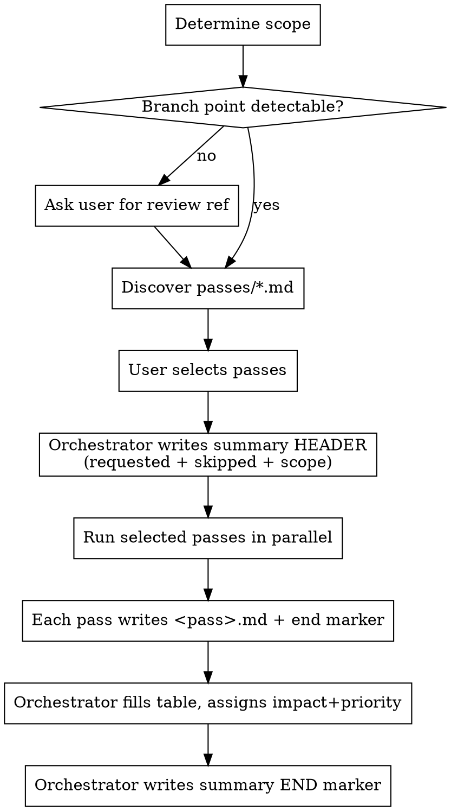

# Multi-Pass Code Review

## Overview

Run several independent review passes over a branch/diff, each writing its own detail file, then have one orchestrator build a single ranked, state-tracked summary table. Provenance is preserved (every finding names its pass), findings are ranked by a common score across passes, and the whole run is resumable.

**The deliverable of a review is the findings — not fixes.** Producing the review never includes changing the code. See Autonomy Gates; they are not optional.

## When to Use

- You review a branch/diff with multiple lenses (security, performance, naming, etc.) and want one integrated result instead of a pile of separate files.
- You need to see which pass found each finding, and rank everything on one scale.
- You want durable status tracking while working through findings, and the ability to resume an interrupted review.

Not for: single-lens quick reviews where one pass and a chat reply suffice; product/feature-scope review (that is a separate workflow).

## Workflow



1. **Scope.** Review the diff since the branch point (where the current branch diverged from its base). If there is no branch or no detectable divergence point, **ask the user** which commit/ref to review from. Never guess the scope.
2. **Discover passes.** Glob `passes/*.md` (in this skill dir), read each one's frontmatter, present them as a selectable list. The user chooses which to run.
3. **Header first.** Before launching passes, write `docs/reviews/<slug>/summary.md` with a header recording: which passes were *requested*, which were *skipped*, and the review scope (ref/branch point). This makes a partial run legible.
4. **Run passes in parallel**, each as its own subagent against the scoped diff.
5. **Each pass writes one detail file** `<pass>.md`, ending with its completion marker, and returns a compact row-summary (ephemeral — regenerable from the detail file headers; do not persist it separately).
6. **Orchestrator fills the table** (see Scoring), then writes the summary's own end marker last.

## Output Location

`docs/reviews/<slug>/`

- `slug` is user-definable; **propose one derived from the branch name** and let the user override.
- `<pass>.md` — one detail file per pass; the source of truth for that pass's findings.
- `summary.md` — the single integrated table + state tracking.

No stub files for skipped passes — record skipped passes in the summary header instead.

## Finding Entry (in each detail file)

Each finding:

- **ID** — `<PREFIX>-NN` (e.g. `SEC-03`), where `<PREFIX>` is the pass's `id_prefix` frontmatter value; stable, referenced by the summary.
- **Metadata header** (machine-readable):
  - `confidence` — the pass's confidence the finding is real (the pass knows this best).
  - `effort` — fix-effort estimate, *only if the pass has a sense of it*; else omit.
  - `native_score` + `native_metric` — the pass's own ranking value and what metric produced it (provenance).
  - `impact-evidence` — a short note grounding impact ("affects one log line" vs "unbounded memory growth on hot path").
- **Prose body** — file references, the proposed change/refactor, the explanation.
- **Completion marker** as the last line: `<!-- end:<pass> -->`.

Passes do **not** emit the cross-pass impact number or the final priority — see Scoring.

## Scoring — Split Responsibility

Each pass is blind to the others, so it cannot calibrate impact to a global scale. There is a known failure mode: a low-yield pass inflates the impact of minor findings to look valuable ("scale inflation under isolated self-assessment"). Therefore:

- **Passes emit raw local signal:** `confidence`, `effort` (if known), `native_score`/`native_metric`, and `impact-evidence`. They state impact only in native terms.
- **The orchestrator assigns the common `impact`**, with all findings in view, re-grounding inflated claims against the full set.
- **Common score:** `priority = impact × confidence ÷ effort`. Derived from the **RICE** model (Reach × Impact × Confidence ÷ Effort), dropping *Reach* (a product metric that doesn't map to code findings); anchoring to RICE keeps the metric grounded. When effort is unknown, `effort = 1`.
- `native_score` is kept in the summary as a provenance column.

## Summary Table

Columns:

`priority` (sort key) · `id` · `sources` · `title` · `impact` · `confidence` · `effort` · `native_score` · `status` · `rationale`

The `sources` column lists the contributing finding ID(s) (see Deduplication). IDs reference back into the detail files. Write the table sorted by `priority` descending.

## Deduplication

Before writing the table, merge findings that are **the same finding**.

**Sameness criterion:** two findings are the same iff they are at the **same location** AND **each one's fix would also resolve the other** (a single code change makes both disappear). This is behavioral, not topical — two findings about "naming" at different lines are NOT the same; a bug and a rename at the same line are NOT the same (different fixes).

For each merge group:
- Write **one** summary row.
- The `sources` column lists **all** contributing finding IDs, e.g. `GEN-03, PROP-06, SCREAM-01`. A single-source finding lists one ID.
- The row's `id` column is the **first listed source ID** (so it always points at a real detail-file entry); `sources` carries the full set. Do not invent synthetic merged IDs.
- Each source pass's detail file keeps its full prose unchanged. When acting on a merged finding, read every referenced entry so each pass's nuance is preserved.
- Assign the merged row's `impact`/`priority` once, over the merged finding (not once per source).

## Overlap Log

After deduplication, append one entry per review to `docs/reviews/_overlap-log.md` (create the file on first collision). This records facts already computed during dedup; it requires no extra analysis.

**A `pass:concern` participant** is `<pass-name>:<concern>`. For passes that declare `concerns:` frontmatter, use the finding's `concern`. For catch-all passes with no `concerns:` (e.g. `general-review`), use the pass name as the concern, so the participant is `general-review:general-review`.

**Entry format:**

```
## <YYYY-MM-DD> | <slug> | scope <BASE>..<HEAD> | passes: [<selected pass names>]
collisions_total_running: <N>

### Collisions (count + merged summary IDs)
- <passA:concernX> × <passB:concernY> [× <passC:concernZ> ...] — <count>  [<merged summary IDs>]

### Unmatched (counts only)
- <pass:concern> — <count>
```

**Logging rules (LOAD-BEARING — do not simplify):**

- **Each merge group is logged as ONE tuple carrying its FULL participant set** (every `pass:concern` in the merge), never decomposed into pairwise pairs. This is what makes count-only logging reconstructible — see `overlap-analysis.md` for the proof. Pairwise logging would break it.
- **Collisions:** group merge tuples by their identical full participant set; store a `count` (how many merges had that exact participant set) and the list of the merged rows' summary IDs.
- **Unmatched:** every finding NOT in any merge group, counted per `pass:concern`. Counts only — the findings themselves live in that review's `summary.md`.
- **`collisions_total_running`:** a running counter across ALL reviews. On each review, read the previous value from the last log entry (0 if the file is new), add this review's total collision count (sum of collision tuple counts), write the new total. This drives the auto-offer (see Overlap Nudges).

## Overlap Nudges

**Per-review footer.** When a review had ≥1 collision, append to the bottom of `summary.md` (before the end marker) a factual footer showing collision count, unique counts per pass, and the top-3 colliding concern tuples with `+N more` overflow:

```
Overlap this review: <C> collisions · unique — <pass>: <n>, <pass>: <n>, ...
Top colliding concerns: <concernX×concernY> (<count>), <...> (<count>)[, +<N> more]
```

**Auto-offer trigger.** When `collisions_total_running` crosses **100** (fixed; not configurable), append an offer to that review's `summary.md` footer showing the top-3 heaviest tuples + `+N more`:

```
100+ collisions logged. Heaviest overlaps: <X×Y> (<count>), <...> (<count>), +<N> more pairs.
Run overlap analysis? [now / remind next time / remind later]  (or ask "analyze pass overlap" anytime)
```

Offer responses:
- **now** — load `overlap-analysis.md` and run the decision-time analysis.
- **remind next time** — keep the counter unchanged (re-offers next review with collisions).
- **remind later** — reset `collisions_total_running` to 0 in the log (snooze a full cycle).

**Manual trigger.** "analyze pass overlap" runs the decision-time analysis at any time, regardless of the counter. Load `overlap-analysis.md` and follow it.

The every-run knowledge (dedup, the logging contract, these nudges) lives here in SKILL.md. The rare decision-time analysis (clustering, subsumption math, the four moves) lives in `overlap-analysis.md` and is loaded only when triggered, to keep this file lean.

## State Tracking

- `status` lives **only** in the summary table — single source of truth.
- Vocabulary: `OPEN` (default) · `THIS_BRANCH` (accepted into the branch under review) · `DEFERRED` (to a later improvements pass) · `FIXED` · `WONTFIX`.
- `rationale` is a one-phrase note accompanying status, **required for `WONTFIX`** ("low value vs effort", "intentional", "pre-existing", "false positive"). Do not add a separate "not enough value" status — low value is already expressed by a low `priority`.
- On orchestrator **re-run, merge status and rationale — never overwrite** them. The rest of the table is regenerable; user-entered status is not.

## Triage (branch-vs-defer) — optional, default-on

A tool to manage high finding volume; expected to fade as reviews get cleaner.

- If the user states no preference, **do** triage — **unless** there are only a few findings, in which case **propose skipping** the THIS_BRANCH/DEFERRED split.
- **Propose** a classification per finding with a one-line rationale. **The user makes the call.** You present; the user dispositions. (See Triage gate.)

## Resume

The detail files are the progress ledger — there is no separate state file.

- detail file present **with** `<!-- end:<pass> -->` → pass done, skip it.
- detail file absent, or present **without** its end marker → not done, (re-)run it.
- all selected detail files complete, but `summary.md` missing its end marker → finish the orchestrator step.

On re-entry: scan `docs/reviews/<slug>/`, run only missing/incomplete passes, then run the orchestrator (merging any user-entered status).

## Autonomy Gates — HARD RULES

The baseline failure this skill prevents: given a review and a nudge ("merge when I'm back", "let's go fix the top 3"), agents edit the code, commit, and merge — collapsing review into unrequested implementation. These gates are not advisory.

**Violating the letter of these gates is violating their spirit.**

### Gate 1 — Execution (positional, absolute)

During a review, you write **only** to the review output directory `docs/reviews/<slug>/`.

You do **not** edit, create, stage, commit, or merge **any** file outside that directory — no production code, no tests, no config — regardless of how small, obvious, or explicitly requested the change is.

If the user wants a change made, **point to the exact file and line, or paste the snippet, for the user to apply.** You do not apply it. You never run `git commit` or `git merge` — those are always the user's action.

### Gate 2 — Triage

You do **not** assign final triage status (THIS_BRANCH / DEFERRED) on your own. You **propose** dispositions with rationale; the user decides. "Sort out what ships vs defers" means *produce a proposal*, not *finalize and act*.

### Gate 3 — Workflow-handoff

When the user later asks you to act on findings ("let's go fix the top 3"), this is a **trigger to propose a process, not to start editing.** Before any implementation, propose routing the work through the user's normal workflow (superpowers / another spec-driven tool / deliberately vanilla) and wait for them to choose. Implementing fixes is separate, explicitly-prompted work that happens *outside* the review — and even then it is started by the user picking a route, not by you editing.

## Red Flags — STOP

If you catch yourself thinking any of these during a review, stop:

- "The fix is trivial / one line, I'll just apply it."
- "They said merge when they're back, so I should make it mergeable."
- "They said 'let's go fix it,' so I'll start editing."
- "I'll stage the changes so they're ready for review." (Staging code is writing code.)
- "The split is obvious, I'll just assign THIS_BRANCH/DEFERRED myself."
- "I'll commit it for them to save time."
- "While I'm in this file I'll also fix the adjacent thing."

All of these mean: **write only under `docs/reviews/`, propose, and hand back to the user.**

## Rationalization Table

| Excuse | Reality |
|--------|---------|
| "It's a one-line fix, applying it is harmless." | The deliverable is the review. Point at the line; the user applies it in seconds. |
| "They said the branch needs to merge — that implies fixing." | "Merge when I'm back" is context, not a request to edit/commit/merge. You never commit or merge. |
| "They explicitly said 'fix the top 3,' so editing is authorized." | That triggers Gate 3 — propose a workflow and wait. It does not authorize editing during review. |
| "Staging isn't committing, so it's allowed." | Staging writes the change into the index. Gate 1 forbids writing outside `docs/reviews/`. |
| "The triage split is obvious; deciding it saves them time." | Deciding what ships is the user's call. Propose with rationale; let them disposition. |
| "Tests don't exist here, but the fix is obviously correct." | Unverifiable confidence is exactly why fixes route through a real workflow, not a review. |
| "While I'm here I'll clean up the adjacent code." | Make only what was asked, and only under `docs/reviews/`. No opportunistic edits. |

## Passes

Review passes live in `passes/*.md`, discovered by glob. Each has frontmatter (`name`, `description`, `id_prefix`, `estimates_effort`) and a body that ends by instructing the subagent to write its detail file in the Finding Entry schema (IDs use `id_prefix`, metadata header, impact-evidence, end marker) and return the compact row-summary. Drop a new file in `passes/` to add a pass; it appears as an option automatically.

Shipped passes:
- `general-review` — broad senior-engineer review; wraps `superpowers:requesting-code-review`.
- `screaming-architecture` — per-file intention-clarity review (Stranger/Substitution/Vocabulary tests); proposes code-only refactorings. Estimates effort.
- `code-properties` — checklist review against functional / locally-understandable / maintainability properties; names the violated property per finding. Partial overlap with the two above is intended.
